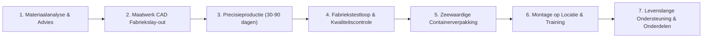

# [Rumtoo Machinery](https://www.recyclemachine.net/nl/)
### Toonaangevende Fabrikant van Kunststof Recycling Machines & Turnkey Oplossingen

[250--1915-25D366?style=for-the-badge&logo=whatsapp&logoColor=white)](https://wa.me/13322501915)

 

🌐 **Talen / Languages:**  
**[English](README.md)** | **[Español](README_es.md)** | **[Deutsch](README_de.md)** | **[Français](README_fr.md)** | **[Italiano](README_it.md)** | **[Nederlands](README_nl.md)** | **[Русский](README_ru.md)** | **[العربية](README_ar.md)** | **[简体中文](README_zh.md)**

 

*Transformatie van Wereldwijd Plastic Afval naar Hoogwaardige Schone Flakes en Uniforme Korrels*

---

## 📌 Inhoudsopgave
- [Over Rumtoo Machinery](#-over-rumtoo-machinery)
- [Kerncijfers en Voordelen](#-kerncijfers-en-voordelen)
- [Turnkey Systemen en Machinelinks](#-turnkey-systemen-en-machinelinks)
  - [1. Kunststof Was- en Recyclinglijnen](#1-kunststof-was--en-recyclinglijnen)
  - [2. Verkleiningstechniek (Shredders en Brekers)](#2-verkleiningstechniek-shredders-en-brekers)
  - [3. Kunststof Pelletiseerlijnen (Regranulatie)](#3-kunststof-pelletiseerlijnen-regranulatie)
  - [4. Randapparatuur, Scheiding en Ontwatering](#4-randapparatuur-scheiding-en-ontwatering)
  - [5. Balenpersen en Sortering van Huishoudelijk Afval (MSW)](#5-balenpersen-en-sortering-van-huishoudelijk-afval-msw)
- [Specificatie- en Toepassingstabel](#-specificatie--en-toepassingstabel)
- [Turnkey Projectaanpak](#-turnkey-projectaanpak)
- [Waarom Klanten Kiezen voor Rumtoo](#-waarom-klanten-kiezen-voor-rumtoo)
- [Klantervaringen](#-klantervaringen)
- [Contact en Fabrieksbezoek](#-contact-en-fabrieksbezoek)

---

## 🏢 Over Rumtoo Machinery

**[Rumtoo Machinery](https://www.recyclemachine.net/nl/)** is een wereldwijd gewaardeerde fabrikant van hoogwaardige **[kunststof recycling machines](https://www.recyclemachine.net/nl/)**, **[complete wasinstallaties](https://www.recyclemachine.net/nl/)**, **[industriële shredders](https://www.recyclemachine.net/nl/)**, **[zware brekers / granulatoren](https://www.recyclemachine.net/nl/)** en **[pelletiseersystemen](https://www.recyclemachine.net/nl/)**. Onze fabriek bevindt zich in Zhangjiagang (Suzhou, provincie Jiangsu, China). Met meer dan 20 jaar ervaring ondersteunen we recyclingbedrijven in meer dan 50 landen.

Wij geloven dat **plastic geen afval is, maar een waardevolle circulaire grondstof**. Rumtoo is gespecialiseerd in het verwerken van zwaar vervuild post-consumer afval (zand, aarde, vetten en oliën), en zet dit om in zuivere flakes en hoogwaardig gerecycled granulaat volgens strenge internationale normen.

---

## ⚡ Kerncijfers en Voordelen

| Indicator | Prestatie | Beschrijving |
| :--- | :--- | :--- |
| **🏭 Ervaring** | **20+ Jaar** | Grondige expertise in mechanische recycling en [complete recyclingoplossingen](https://www.recyclemachine.net/complete-recycling-solutions/) |
| **🌍 Wereldwijd Bereik** | **50+ Landen** | Honderden actieve was- en pelletiseerlijnen in Europa, Amerika, het Midden-Oosten en Azië |
| **♻️ Maandelijkse Verwerking** | **10.000+ Ton** | Kunststof afval dat maandelijks op Rumtoo-lijnen wordt verwerkt |
| **⚡ Zuiverheid** | **Tot 99,8%** | Maximale scheiding voor hergebruik in levensmiddelenkwaliteit (B2B) of vezels |
| **💧 Restvocht** | **< 1,0%** | Zeer droge flakes, direct klaar voor snelle extrusie |
| **⏱️ Snelle Terugverdientijd** | **6 - 12 Maanden** | Hoge kostenefficiëntie met een zeer laag energieverbruik per ton |

---

## 🛠️ Turnkey Systemen en Machinelinks

### 1. Kunststof Was- en Recyclinglijnen
* **[PET Flessen Waslijn](https://www.recyclemachine.net/pet-bottle-recycling-system/)**:
  * Volledig geautomatiseerd voor drankflessen en thermovormfolies.
  * Inclusief **[Automatische Etikettenverwijderaar](https://www.recyclemachine.net/plastic-bottle-label-removal-machine/)**, **[Natte Breker](https://www.recyclemachine.net/wet-plastic-crusher/)**, **[Continu Heetwassysteem](https://www.recyclemachine.net/continuous-hot-washer-system-for-pet-and-hdpe-flakes/)** en **[Zink-Drijftank voor PET](https://www.recyclemachine.net/pet-flake-purification-separation-tank/)**.
  * PVC-gehalte < 50 ppm, restvocht < 1%.
* **[PP / PE Folie- en Woven Bag Waslijn](https://www.recyclemachine.net/plastic-film-washing-line/)**:
  * Voor landbouwfolie, LDPE-stretchfolie en PP-bigbags (FIBC).
  * Uitgerust met **[Frictiewasschroef](https://www.recyclemachine.net/friction-screw-washer-machine/)** en mechanische **[Folie-Uitpersdroger (Squeezer)](https://www.recyclemachine.net/plastic-film-squeezing-machine)** (< 2% vocht).
* **[HDPE Flessen- en Flacon Waslijn](https://www.recyclemachine.net/hdpe-bottle-washing-recycling-line/)**.
* **[Recyclinglijn voor Harde Kunststoffen (PP / HDPE / PVC)](https://www.recyclemachine.net/rigid-plastic-washing-line-for-pp-hdpe-pvc/)**.
* **[Waslijnen voor Gevaarlijke en Chemische Verpakkingen](https://www.recyclemachine.net/hazardous-plastic-recycling/)**.

---

### 2. Verkleiningstechniek (Shredders en Brekers)
* **[Enkelassige Shredder met Hydraulische Aandrukker](https://www.recyclemachine.net/single-shaft-shredders-with-drawer/)**:
  * Krachtig koppel voor foliebalen, massieve kluiten, buizen en harde kunststofblokken zonder vastlopen.
* **[Enkelassige Shredder voor PE/PP Folie en Rafia](https://www.recyclemachine.net/single-shaft-shredder-for-pe-pp-film-raffia-woven-recycling/)**:
  * Anti-wikkelrotor voorkomt dat dunne folies en garens vastslaan.
* **[Dubbelassige Shredder (Plastic, Metaal en Banden)](https://www.recyclemachine.net/double-shaft-shredder-for-plastic-metal-and-tire-recycling/)**:
  * Laag toerental en hoog koppel voor vaten, autobumpers en [bandenrecycling](https://www.recyclemachine.net/tire-recycling-machine/).
* **[Zware Kunststof Breker (Granulator)](https://www.recyclemachine.net/heavy-duty-plastic-crusher/)**:
  * V-vormige messenopstelling voor een zuivere schaarwerking en minimale stofvorming.
* **[Natte Breker](https://www.recyclemachine.net/wet-plastic-crusher/)** met directe waterinjectie.
* **[Horizontale Buizenbreker voor PVC en PE](https://www.recyclemachine.net/crusher-for-pvc-pipe-and-profiles/)**.
* **[Industriële Shredder voor Grote HDPE Buizen tot 1200 mm](https://www.recyclemachine.net/industrial-hdpe-pipe-shredder/)**.
* **[Geïntegreerde Shredder-Breker Combinatie (2-in-1)](https://www.recyclemachine.net/integrated-shredder-and-crusher-machine/)**.
* **[Textiel- en Vezelshredder](https://www.recyclemachine.net/textile-fibre-shredder/)**.

---

### 3. Kunststof Pelletiseerlijnen (Regranulatie)
* **[Folie Pelletiseerlijn met Cutter Compactor](https://www.recyclemachine.net/cutter-compactor-recycling-pelletizing-line/)**:
  * 3-in-1: versnijden, wrijvingsvoorverwarmen en extruderen in één procesgang voor PE/PP-folies.
* **[PP / PE Folie Pelletiseermachine](https://www.recyclemachine.net/pp-pe-film-pelletizing-machine/)** met dubbele vacuümontgassing.
* **[Tweetraps Cascade Pelletiseerlijn voor Hard Kunststof](https://www.recyclemachine.net/rigid-pp-hdpe-flake-pelletizing-machine/)**.
* **[Waterring Kopslag Pelletiseersysteem](https://www.recyclemachine.net/water-ring-pelletizer-for-pp-and-pe-plastic-film-woven-bags/)**.
* **[Pelletiseerlijn voor PET Flakes](https://www.recyclemachine.net/pet-plastic-flake-single-screw-pelletizer/)**.
* **[EPS Piepschuim Recycling- en Pelletiseerlijn](https://www.recyclemachine.net/eps-foam-pelletizing-machine/)**.
* **[Automatische PVC Poedermolen (Pulverizer)](https://www.recyclemachine.net/pvc-plastic-grinding-machine/)**.

---

### 4. Randapparatuur, Scheiding en Ontwatering
* **[Drierijige Zink-Drijftanks](https://www.recyclemachine.net/advanced-sink-float-separation-triple-row-tank-technology/)** en **[Standaard Tanks](https://www.recyclemachine.net/sink-float-separation-tank/)**.
* **[Centrifugaaldroger (Ontwateringsmachine)](https://www.recyclemachine.net/centrifugal-dryer-dewatering-machine-for-plastic-drying/)** (vocht < 1,5%).
* **[Schroefpersdroger (Squeezer)](https://www.recyclemachine.net/plastic-film-squeezing-machine)** en **[Densifier](https://www.recyclemachine.net/plastic-film-densifier/)**.
* **[Zig-Zag Windzifter](https://www.recyclemachine.net/zig-zag-air-classifier-plastic-recycling/)**.
* **[Wervelstroomscheider (Eddy Current)](https://www.recyclemachine.net/eddy-current-magnetic-separator/)** en **[Magneetscheiders](https://www.recyclemachine.net/magnetic-separator-a-critical-tool-in-material-recovery/)**.
* **[Messen voor Recyclingmachines](https://www.recyclemachine.net/recycling-machine-blades/)** en **[Automatische Messenslijpmachine](https://www.recyclemachine.net/automatic-knife-grinder/)**.

---

### 5. Balenpersen en Sortering van Huishoudelijk Afval (MSW)
* **[Volautomatische Horizontale Kanaalbalenpers met Automatische Afbinding](https://www.recyclemachine.net/horizontal-fully-automatic-hydraulic-baler/)**.
* **[Halfautomatische Balenpersen](https://www.recyclemachine.net/premium-semi-automatic-horizontal-balers/)** en **[Handbediende Verticale Persen](https://www.recyclemachine.net/manual-baling-machine/)**.
* **[Sorteerinstallaties voor Huishoudelijk Afval (MSW)](https://www.recyclemachine.net/msw-sorting-machines/)** met **[Trommelzeven](https://www.recyclemachine.net/trommel-screen/)** en **[Kettingtransporteurs](https://www.recyclemachine.net/chain-waste-conveyor/)**.

---

## 📊 Specificatie- en Toepassingstabel

| Installatie / Machine | Grondstof | Capaciteit | Directe Link en Kenmerken |
| :--- | :--- | :--- | :--- |
| **PET Flessen Waslijn** | Drankflessen, trays | 500 – 3.000 kg/u | [PET Lijn Details](https://www.recyclemachine.net/pet-bottle-recycling-system/) · PVC < 50 ppm, vocht < 1% |
| **PE/PP Folie Waslijn** | Landbouwfolie, bigbags | 300 – 2.000 kg/u | [Folie Lijn Details](https://www.recyclemachine.net/plastic-film-washing-line/) · Frictiewas & squeezer droging |
| **HDPE Flessen Waslijn** | Flacons, bidons, kratten | 500 – 2.500 kg/u | [HDPE Lijn Details](https://www.recyclemachine.net/hdpe-bottle-washing-recycling-line/) · Meertraps zink-drijf scheiding |
| **Compactor Pelletiseerder** | Droge/vochtige folies | 200 – 1.000 kg/u | [Compactor Lijn Details](https://www.recyclemachine.net/cutter-compactor-recycling-pelletizing-line/) · 3-in-1, waterring kopslag |
| **Harde Kunststof Pelletiseerder** | HDPE/PP maalgoed | 200 – 1.200 kg/u | [Harde Lijn Details](https://www.recyclemachine.net/rigid-pp-hdpe-flake-pelletizing-machine/) · Cascade dubbele trap, hydr. zeef |
| **Enkelassige Shredder** | Kluiten, buizen, rollen | 300 – 3.000 kg/u | [Enkelassige Shredder Details](https://www.recyclemachine.net/single-shaft-shredders-with-drawer/) · Hydraulische pusher, D2 messen |
| **Dubbelassige Shredder** | Vaten, autobanden, schroot | 500 – 5.000 kg/u | [Dubbelassige Shredder Details](https://www.recyclemachine.net/double-shaft-shredder-for-plastic-metal-and-tire-recycling/) · Hoog koppel, autoreverse |
| **Zware Granulator** | Kratten, dikke vormdelen | 300 – 2.500 kg/u | [Granulator Details](https://www.recyclemachine.net/heavy-duty-plastic-crusher/) · V-schaarsnede, droog/nat |
| **Kanaalbalenpers Auto** | Karton, folie, PET flessen | 2 – 15 ton/u | [Balenpers Details](https://www.recyclemachine.net/horizontal-fully-automatic-hydraulic-baler/) · Automatische draadafbindmachine |
| **Folie Uitpersdroger** | Natte folie na wassen | 300 – 1.000 kg/u | [Squeezer Details](https://www.recyclemachine.net/plastic-film-squeezing-machine) · Verlaagt vocht van 30% naar < 2% |

---

## 🔄 Turnkey Projectaanpak

1. **[Deskundig Advies](https://www.recyclemachine.net/contact-us/)**: Analyse van verontreinigingsniveaus, energie- en waterbehoeften en gewenste output.
2. **CAD Lay-out Engineering**: Nauwkeurige inrichting van uw bedrijfshal inclusief leidingwerk en waterbassins.
3. **Zware Industriële Bouw**: CNC-bewerking met topcomponenten van gerenommeerde wereldmerken (Siemens, Schneider, NSK/SKF, ABB).
4. **Proefdraaien in de Fabriek**: Uitvoerig mechanisch en elektrisch testen voorafgaand aan verzending. Mogelijkheid tot live inspectie ter plaatse of via HD-videoverbinding.
5. **Verpakking & Zeevracht**: Corrosiepreventie, houten bekisting en stevige containerlashing.
6. **Installatie en Training op Locatie**: Ervaren ingenieurs komen 7–14 dagen naar uw fabriek voor inbedrijfstelling en opleiding van uw personeel.
7. **1 Jaar Volledige Garantie & 24/7 Ondersteuning**: Snelle verzending van slijtdelen. Meer info via **[Bestelproces](https://www.recyclemachine.net/ordering-process/)**.

---

## 🏆 Waarom Klanten Kiezen voor Rumtoo

* 🛡️ **Gebouwd voor Zware Belasting**: Trillingsdempende stalen frames die langdurig bestand zijn tegen zand en abrasieve materialen.
* ⚡ **Aanzienlijke Energie- en Waterbesparing**: Gesloten watercircuits en energiezuinige aandrijvingen verlagen de productiekosten per ton aanzienlijk.
* 🧩 **Internationale Standaardcomponenten**: Siemens besturing en Schneider schakelmateriaal maken lokale vervanging uiterst eenvoudig.

---

## 💬 Klantervaringen

> *"De HDPE-waslijn van Rumtoo presteert uitstekend en heeft onze productiecapaciteit met meer dan 30% verhoogd. Het ingenieursteam reageert buitengewoon snel en vakkundig."*  
> **— Maria Garcia**, Operationeel Manager, EcoPlast Solutions

> *"Geweldige terugverdientijd! Binnen 8 maanden hadden we de investering volledig terugverdiend dankzij de hoge marktprijs van de gerecyclede korrels."*  
> **— Ahmed Hassan**, Directeur, Middle East Plastics Ltd

---

## 📞 Contact en Fabrieksbezoek

Wij heten internationale klanten van harte welkom voor een bezoek aan onze moderne productiefaciliteit in Zhangjiagang (China) of een live online demonstratie:

* 🌐 **Officiële Website**: [www.recyclemachine.net](https://www.recyclemachine.net/nl/)
* 📱 **WhatsApp / Telefoon**: [+1 (332) 250-1915](https://wa.me/13322501915)
* ✉️ **Verkoopafdeling**: [sales@recyclemachine.net](mailto:sales@recyclemachine.net)
* ✉️ **Directie**: [ceo@recyclemachine.net](mailto:ceo@recyclemachine.net)
* 📍 **Fabrieksadres**: Zhangjiagang, Suzhou, provincie Jiangsu, 215600, China
* 🎥 **YouTube Kanaal**: [Rumtoo Recycling Machinery op YouTube](https://www.youtube.com/channel/UCV42rEOir-PpXMGqDFYTayg)
* 💼 **LinkedIn**: [Rumtoo Machinery op LinkedIn](https://www.linkedin.com/company/recycling-machine)
* 🎬 **Machinevideo's**: [Bekijk Machines in Werking](https://www.recyclemachine.net/recycling-video/)

---

Alle rechten voorbehouden © 2026 [Rumtoo Machinery](https://www.recyclemachine.net/nl/). Voor een duurzame circulaire economie van plastics wereldwijd.

