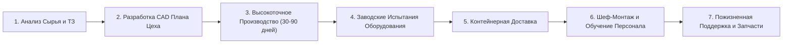

# [Rumtoo Machinery](https://www.recyclemachine.net/ru/)
### Ведущий Производитель Оборудования для Переработки Пластмасс и Комплексных Линий "Под Ключ"

[250--1915-25D366?style=for-the-badge&logo=whatsapp&logoColor=white)](https://wa.me/13322501915)

 

🌐 **Языки / Languages:**  
**[English](README.md)** | **[Español](README_es.md)** | **[Русский](README_ru.md)** | **[العربية](README_ar.md)** | **[Français](README_fr.md)** | **[简体中文](README_zh.md)**

 

*Превращение пластиковых отходов в высококачественную чистую флексу и гранулы высшего сорта*

---

## 📌 Содержание
- [О Компании Rumtoo Machinery](#-о-компании-rumtoo-machinery)
- [Ключевые Показатели и Преимущества](#-ключевые-показатели-и-преимущества)
- [Комплексные Системы и Ссылки на Оборудование](#-комплексные-системы-и-ссылки-на-оборудование)
  - [1. Линии Мойки и Переработки Пластика](#1-линии-мойки-и-переработки-пластика)
  - [2. Измельчители и Дробилки (Шредеры и Грануляторы)](#2-измельчители-и-дробилки-шредеры-и-грануляторы)
  - [3. Системы Грануляции (Пеллетизации)](#3-системы-грануляции-пеллетизации)
  - [4. Вспомогательное Оборудование, Разделение и Сушка](#4-вспомогательное-оборудование-разделение-и-сушка)
  - [5. Гидравлические Прессы и Сортировка ТБО](#5-гидравлические-прессы-и-сортировка-тбо)
- [Технические Характеристики и Применение](#-технические-характеристики-и-применение)
- [Процесс Реализации Проектов "Под Ключ"](#-процесс-реализации-проектов-под-ключ)
- [Почему Выбирают Rumtoo](#-почему-выбирают-rumtoo)
- [Отзывы Международных Партнеров](#-отзывы-международных-партнеров)
- [Контакты и Посещение Завода](#-контакты-и-посещение-завода)

---

## 🏢 О Компании Rumtoo Machinery

**[Rumtoo Machinery](https://www.recyclemachine.net/ru/)** — признанный международный производитель тяжелого оборудования для **[переработки пластмасс](https://www.recyclemachine.net/ru/)**, **[линий мойки](https://www.recyclemachine.net/ru/)**, **[промышленных шредеров](https://www.recyclemachine.net/ru/)**, **[дробилок](https://www.recyclemachine.net/ru/)** и **[линий грануляции](https://www.recyclemachine.net/ru/)**. Наш завод расположен в машиностроительном центре Китая — городе Чжанцзяган (Сучжоу, провинция Цзянсу). Более 20 лет мы разрабатываем и поставляем надежные инженерные решения для переработчиков в более чем 50 странах мира.

Мы убеждены: **пластик — это не мусор, а ценное вторичное сырье**. Мы специализируемся на переработке сильно загрязненных полигонных отходов (песок, органика, масла), гарантируя высокую производительность, стабильность работы и непревзойденную чистоту конечного сырья.

---

## ⚡ Ключевые Показатели и Преимущества

| Показатель | Достижение | Описание |
| :--- | :--- | :--- |
| **🏭 Опыт Производства** | **Более 20 лет** | Глубокая экспертиза в механической переработке и [комплексных решениях](https://www.recyclemachine.net/complete-recycling-solutions/) |
| **🌍 География Поставок** | **50+ стран** | Сотни действующих комплексов в СНГ, Европе, Латинской Америке и Азии |
| **♻️ Месячная Переработка** | **10,000+ тонн** | Объем перерабатываемых полимеров на линиях Rumtoo ежемесячно |
| **⚡ Чистота Флексы** | **До 99.8%** | Соответствие строгим требованиям для пищевой гранулы (B2B) и химволокна |
| **💧 Остаточная Влажность** | **Менее 1.0%** | Сухая флекса, готовая к мгновенной экструзии без слипания |
| **⏱️ Срок Окупаемости (ROI)** | **6 - 12 месяцев** | Высокая энергоэффективность при доступной стоимости инвестиций |

---

## 🛠️ Комплексные Системы и Ссылки на Оборудование

### 1. Линии Мойки и Переработки Пластика
* **[Линия Мойки ПЭТ Бутылок](https://www.recyclemachine.net/pet-bottle-recycling-system/)**:
  * Включает **[Роторный Отделитель Этикетки](https://www.recyclemachine.net/plastic-bottle-label-removal-machine/)**, **[Мокрую Дробилку](https://www.recyclemachine.net/wet-plastic-crusher/)**, **[Ванну Горячей Мойки](https://www.recyclemachine.net/continuous-hot-washer-system-for-pet-and-hdpe-flakes/)** и **[Ванну Флотации ПЭТ](https://www.recyclemachine.net/pet-flake-purification-separation-tank/)**.
  * Содержание ПВХ < 50 ppm, влажность < 1%.
* **[Линия Мойки Пленочных Материалов и Биг-Бэгов (ПП / ПЭ)](https://www.recyclemachine.net/plastic-film-washing-line/)**:
  * Для загрязненной агропленки, стрейча и полипропиленовых мешков.
  * Оснащена **[Высокоскоростной Фрикционной Мойкой](https://www.recyclemachine.net/friction-screw-washer-machine/)** и **[Отжимным Пресс-Драйером (Сквизером)](https://www.recyclemachine.net/plastic-film-squeezing-machine)**.
* **[Линия Мойки Твердых Флаконов и Канистр ПНД (HDPE)](https://www.recyclemachine.net/hdpe-bottle-washing-recycling-line/)**.
* **[Комплекс Переработки Жестких Пластиков (PP / HDPE / PVC)](https://www.recyclemachine.net/rigid-plastic-washing-line-for-pp-hdpe-pvc/)**.
* **[Переработка Канистр из-под Пестицидов и Опасных Веществ](https://www.recyclemachine.net/hazardous-plastic-recycling/)**.

---

### 2. Измельчители и Дробилки (Шредеры и Грануляторы)
* **[Однороторный Шредер с Гидравлической Пресс-Плитой](https://www.recyclemachine.net/single-shaft-shredders-with-drawer/)**:
  * Для литников, слитков, толстостенных труб, рулонов пленки и спрессованных тюков.
* **[Шредер для Пленки, Тканых Мешков и Рафии](https://www.recyclemachine.net/single-shaft-shredder-for-pe-pp-film-raffia-woven-recycling/)**:
  * Специальная геометрия ротора против наматывания нитей.
* **[Двухвальный Шредер (Пластик, Металл, Автопокрышки)](https://www.recyclemachine.net/double-shaft-shredder-for-plastic-metal-and-tire-recycling/)**:
  * Низкая скорость, высокий крутящий момент, переработка крупногабаритных баков и [шин](https://www.recyclemachine.net/tire-recycling-machine/).
* **[Тяжелая Промышленная Дробилка Пластмасс](https://www.recyclemachine.net/heavy-duty-plastic-crusher/)**:
  * "V"-образная форма ротора для снижения пылеобразования.
* **[Мокрая Дробилка](https://www.recyclemachine.net/wet-plastic-crusher/)** с подачей воды в зону резания.
* **[Трубная Дробилка с Горизонтальной Подачей (ПВХ/ПНД)](https://www.recyclemachine.net/crusher-for-pvc-pipe-and-profiles/)**.
* **[Промышленный Шредер для Больших Труб ПНД до 1200 мм](https://www.recyclemachine.net/industrial-hdpe-pipe-shredder/)**.
* **[Комбинированный Шредер-Дробилка (2 в 1)](https://www.recyclemachine.net/integrated-shredder-and-crusher-machine/)**.
* **[Шредер для Текстиля и Волокон](https://www.recyclemachine.net/textile-fibre-shredder/)**.

---

### 3. Системы Грануляции (Пеллетизации)
* **[Линия Грануляции с Пласткомпактором (Cutter Compactor)](https://www.recyclemachine.net/cutter-compactor-recycling-pelletizing-line/)**:
  * 3 в 1: предварительное измельчение, разогрев и экструзия для легких пленок и мешков.
* **[Экструдер-Гранулятор для Пленки ПП / ПЭ](https://www.recyclemachine.net/pp-pe-film-pelletizing-machine/)** с двухзонной вакуумной дегазацией.
* **[Двухкаскадная Линия Грануляции Дробленки (ПНД, ПП, АБС)](https://www.recyclemachine.net/rigid-pp-hdpe-flake-pelletizing-machine/)**.
* **[Водокольцевая Торцевая Резка](https://www.recyclemachine.net/water-ring-pelletizer-for-pp-and-pe-plastic-film-woven-bags/)**.
* **[Линия Грануляции ПЭТ Флексы](https://www.recyclemachine.net/pet-plastic-flake-single-screw-pelletizer/)**.
* **[Линия Грануляции Пенопласта (EPS / EPE)](https://www.recyclemachine.net/eps-foam-pelletizing-machine/)**.
* **[Турбо-Мельница (Пульверайзер) для ПВХ](https://www.recyclemachine.net/pvc-plastic-grinding-machine/)**.

---

### 4. Вспомогательное Оборудование, Разделение и Сушка
* **[Трехрядная Ванна Флотации](https://www.recyclemachine.net/advanced-sink-float-separation-triple-row-tank-technology/)** и **[Стандартная Ванна](https://www.recyclemachine.net/sink-float-separation-tank/)**.
* **[Центробежная Сушилка (Дегидратор)](https://www.recyclemachine.net/centrifugal-dryer-dewatering-machine-for-plastic-drying/)** (влажность < 1.5%).
* **[Шнековый Пресс-Отжим (Сквизер)](https://www.recyclemachine.net/plastic-film-squeezing-machine)** и **[Денсификатор](https://www.recyclemachine.net/plastic-film-densifier/)**.
* **[Аэродинамический Сепаратор Zig-Zag](https://www.recyclemachine.net/zig-zag-air-classifier-plastic-recycling/)**.
* **[Вихретоковый Сепаратор Цветных Металлов](https://www.recyclemachine.net/eddy-current-magnetic-separator/)** и **[Магнитные Сепараторы](https://www.recyclemachine.net/magnetic-separator-a-critical-tool-in-material-recovery/)**.
* **[Ножи для Дробилок и Шредеров](https://www.recyclemachine.net/recycling-machine-blades/)** и **[Заточной Станок](https://www.recyclemachine.net/automatic-knife-grinder/)**.

---

### 5. Гидравлические Прессы и Сортировка ТБО
* **[Горизонтальный Автоматический Пресс с Обвязкой](https://www.recyclemachine.net/horizontal-fully-automatic-hydraulic-baler/)**.
* **[Полуавтоматические](https://www.recyclemachine.net/premium-semi-automatic-horizontal-balers/)** и **[Вертикальные Прессы](https://www.recyclemachine.net/manual-baling-machine/)**.
* **[Мусоросортировочные Комплексы ТБО](https://www.recyclemachine.net/msw-sorting-machines/)** с **[Барабанными Грохотами (Троммелями)](https://www.recyclemachine.net/trommel-screen/)** и **[Пластинчатыми Конвейерами](https://www.recyclemachine.net/chain-waste-conveyor/)**.

---

## 📊 Технические Характеристики и Применение

| Оборудование / Линия | Сырье | Производительность | Ссылка на Модель и Особенности |
| :--- | :--- | :--- | :--- |
| **Мойка ПЭТ Бутылок** | ПЭТ тара, бутылки, лотки | 500 – 3,000 кг/ч | [Перейти к линии ПЭТ](https://www.recyclemachine.net/pet-bottle-recycling-system/) · ПВХ < 50 ppm, влажность < 1% |
| **Мойка Пленки ПП/ПЭ** | Агропленка, биг-бэги, стрейч | 300 – 2,000 кг/ч | [Перейти к линии пленки](https://www.recyclemachine.net/plastic-film-washing-line/) · Фрикционная мойка и сквизер |
| **Мойка Канистр ПНД** | Канистры, флаконы, ящики | 500 – 2,500 кг/ч | [Перейти к линии ПНД](https://www.recyclemachine.net/hdpe-bottle-washing-recycling-line/) · Многоступенчатая флотация |
| **Компактор-Гранулятор** | Пленка ПП/ПД, мешки | 200 – 1,000 кг/ч | [Перейти к компактору](https://www.recyclemachine.net/cutter-compactor-recycling-pelletizing-line/) · 3 в 1, резка на фильере |
| **Гранулятор Дробленки** | Дробленый ПНД, ПП, АБС | 200 – 1,200 кг/ч | [Перейти к гранулятору](https://www.recyclemachine.net/rigid-pp-hdpe-flake-pelletizing-machine/) · Двухкаскадный, гидравлический фильтр |
| **Однороторный Шредер** | Слитки, пусковые комья, трубы | 300 – 3,000 кг/ч | [Перейти к шредеру](https://www.recyclemachine.net/single-shaft-shredders-with-drawer/) · Гидротолкатель, ножи D2 |
| **Двухвальный Шредер** | Бочки, покрышки, бытовой лом | 500 – 5,000 кг/ч | [Перейти к 2-вальному шредеру](https://www.recyclemachine.net/double-shaft-shredder-for-plastic-metal-and-tire-recycling/) · Высокий момент, автореверс |
| **Тяжелая Дробилка** | Ящики, толстостенные детали | 300 – 2,500 кг/ч | [Перейти к дробилке](https://www.recyclemachine.net/heavy-duty-plastic-crusher/) · V-образный ротор, сухой/мокрый помол |
| **Автоматический Пресс** | Картон, ПЭТ бутылки, пленка | 2 – 15 тонн/час | [Перейти к прессу](https://www.recyclemachine.net/horizontal-fully-automatic-hydraulic-baler/) · Автоматическая обвязка проволокой |
| **Шнековый Пресс-Сквизер** | Влажная пленка после мойки | 300 – 1,000 кг/ч | [Перейти к сквизеру](https://www.recyclemachine.net/plastic-film-squeezing-machine) · Снижает влажность с 30% до < 2% |

---

## 🔄 Процесс Реализации Проектов "Под Ключ"

1. **[Консультация и Анализ Сырья](https://www.recyclemachine.net/contact-us/)**: Оценка загрязненности пластика, требований к воде/электричеству и требуемой чистоты.
2. **Индивидуальный CAD-Проект**: Планировка оборудования с учетом габаритов вашего цеха, приямков и энергосетей.
3. **Надежное Изготовление**: Прочные сварные рамы, комплектующие мировых брендов (Siemens, Schneider, NSK/SKF, ABB).
4. **Заводские Испытания Перед Отгрузкой**: Полное тестирование в цехе. Приглашаем на инспекцию лично или по HD-видеосвязи.
5. **Экспортная Упаковка и Доставка**: Антикоррозийная обработка, деревянные ярусы и надежная фиксация в контейнерах.
6. **Шеф-Монтаж и Пусконаладка**: Выезд квалифицированных инженеров на 7–14 дней для запуска линии и обучения операторов.
7. **Гарантия 1 Год и Сервис 24/7**: Быстрая отправка запасных частей. Подробнее: **[Порядок Заказа](https://www.recyclemachine.net/ordering-process/)**.

---

## 🏆 Почему Выбирают Rumtoo

* 🛡️ **Создано для Тяжелых Условий**: Усиленная виброустойчивая конструкция для абразивных и полигонных отходов.
* ⚡ **Низкая Себестоимость Переработки**: Замкнутый цикл водооборота и энергоэффективные двигатели.
* 🧩 **Европейские и Международные Комплектующие**: Электрика Schneider, контроллеры Siemens — легкий поиск запчастей на месте.

---

## 💬 Отзывы Международных Партнеров

> *"Линия мойки ПНД от Rumtoo показала превосходную производительность, увеличив наш объем выпуска более чем на 30%. Инженеры компании обеспечили плавный и быстрый запуск."*  
> **— Мария Гарсия**, Операционный директор, EcoPlast Solutions

> *"Отличная окупаемость! Вложения в линию полностью вернулись за 8 месяцев благодаря высокому качеству получаемой гранулы."*  
> **— Ахмед Хассан**, Генеральный директор, Middle East Plastics Ltd

---

## 📞 Контакты и Посещение Завода

Мы приглашаем вас посетить наше производство в городе Чжанцзяган (Китай) или заказать онлайн-демонстрацию:

* 🌐 **Официальный Сайт**: [www.recyclemachine.net](https://www.recyclemachine.net/ru/)
* 📱 **WhatsApp / Телефон**: [+1 (332) 250-1915](https://wa.me/13322501915)
* ✉️ **Отдел Продаж**: [sales@recyclemachine.net](mailto:sales@recyclemachine.net)
* ✉️ **Руководство**: [ceo@recyclemachine.net](mailto:ceo@recyclemachine.net)
* 📍 **Адрес Завода**: Чжанцзяган, Сучжоу, Цзянсу, 215600, Китай
* 🎥 **YouTube Канал**: [Rumtoo Recycling Machinery на YouTube](https://www.youtube.com/channel/UCV42rEOir-PpXMGqDFYTayg)
* 💼 **LinkedIn**: [Rumtoo Machinery в LinkedIn](https://www.linkedin.com/company/recycling-machine)
* 🎬 **Видео Видеотека Оборудования**: [Смотреть Видео Работы Станков](https://www.recyclemachine.net/recycling-video/)

---

Все права защищены © 2026 [Rumtoo Machinery](https://www.recyclemachine.net/ru/). Развиваем циклическую экономику переработки пластмасс во всем мире.

